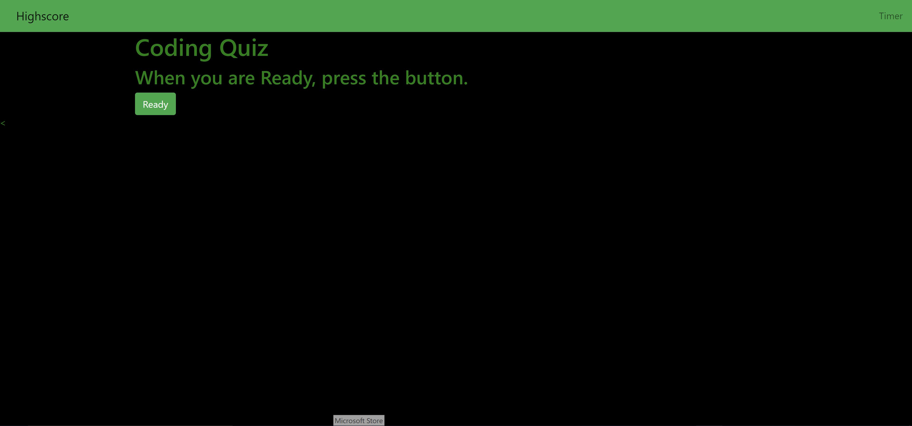

# Coding Quiz

## Overview

This is a quiz to test your basic knowledge on coding and syntaxes. How high of a score can you get?

## Description

This is application is made through javascript, html, css and jquery. There is Dom manipulation involved and bootstrap is involved in order to keep the style and navbar in check. There is bootstrap column classes to keep everything in the center of the page. The answer text color matches the color of the background so we can use the hover property to bring out the answer. There is a final score based on how much time is left on the timer.

### Application

https://latinobull.github.io/Coding-Quiz/
